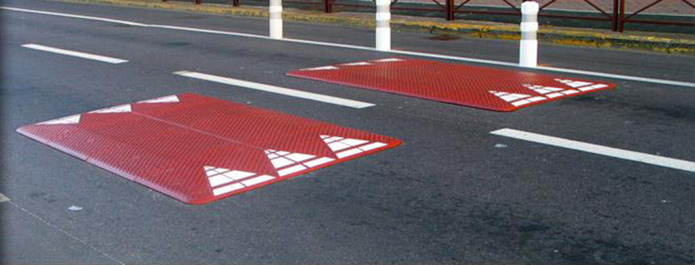
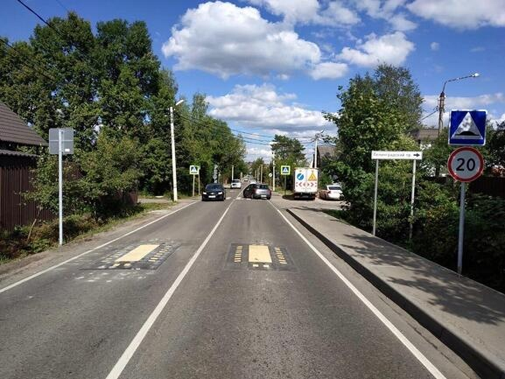
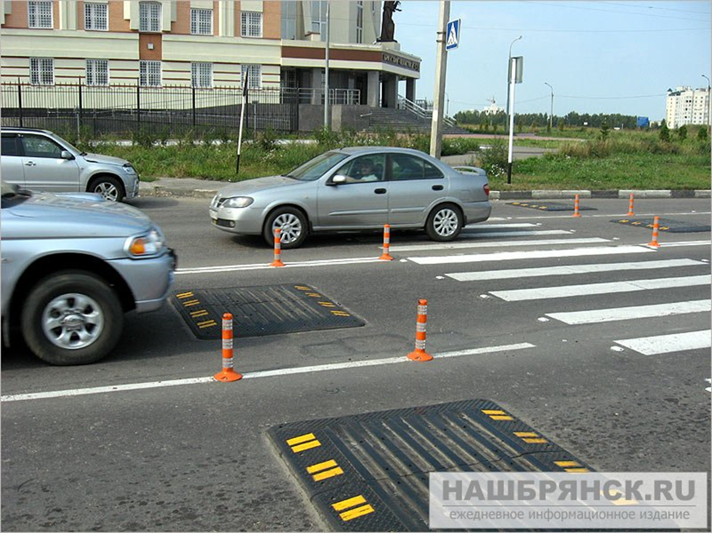

#"Берлинская" подушка

[1]

«Берлинская подушка» получила название по месту применения — её часто можно увидеть на улицах Берлина, а также Амстердама. Она представляет собой квадрат, размещенный в центре полосы движения. Легковые машины с узкой колеей должны притормаживать, чтобы проехать по наименее возвышенным участкам препятствия и не нагружать чрезмерно подвеску, а грузовые автомобили и автобусы минуют его без шума, «пропуская» подушку между колес. [2]

На данный момент в России нет отдельного пункта в ГОСТах для «берлинских подушек»
Обычные «лежачие полицейские» регламентируются ГОСТ Р 52605-2006 «Технические средства организации дорожного движения ИСКУССТВЕННЫЕ НЕРОВНОСТИ Общие технические требования. Правила применения»

#Зачем?

1.	По сравнению с обычными лежачими полицейскими «подушки» более компактны и занимают не всю проезжую часть. Машины с широкой колесной базой, то есть автобусы и грузовики, ее не замечают: проезжают без подпрыгиваний и шума. А легковушки, которые на дорогах обычно ведут себя более резко, вынужденно снижают скорость. При этом благодаря более плавной форме конструкции подвеска автомобиля не страдает. [3]
2.	Также «Берлинская подушка» не препятствует проезду велосипедов и других средств индивидуальной мобильности.
3.  В процессе эксплуатации нагрузка на такие искусственные возвышения гораздо ниже, чем на привычные поперечные накладки [4]

#Примеры различных способов реализации «берлинской подушки»

 *Источник [2]* 

 *Источник [5]*

 *Источник [1]*

[1]: https://www.active-line.pro/produkty/elementy-obustrojstva-avtomobilnyh-dorog/berlinskie-podushki.html 
[2]: https://www.zr.ru/content/news/924675-lezhachikh-politsejskikh-zamenyat/ 
[3]: https://mosregtoday.ru/sec/nazvany-preimuschestva-berlinskoy-podushki-vpervye-poyavivsheysya-na-doroge-podmoskov-ya/
[4]: https://lada-xray2.ru/vse-novosti/lezhachikh-politseyskikh-vytesnyat-berlinskie-podushki    
[5]: https://traditio.wiki/%D0%A7%D0%B5%D1%80%D0%BD%D0%BE%D0%B2%D0%B8%D0%BA:%D0%91%D0%B5%D1%80%D0%BB%D0%B8%D0%BD%D1%81%D0%BA%D0%B0%D1%8F_%D0%BF%D0%BE%D0%B4%D1%83%D1%88%D0%BA%D0%B0
