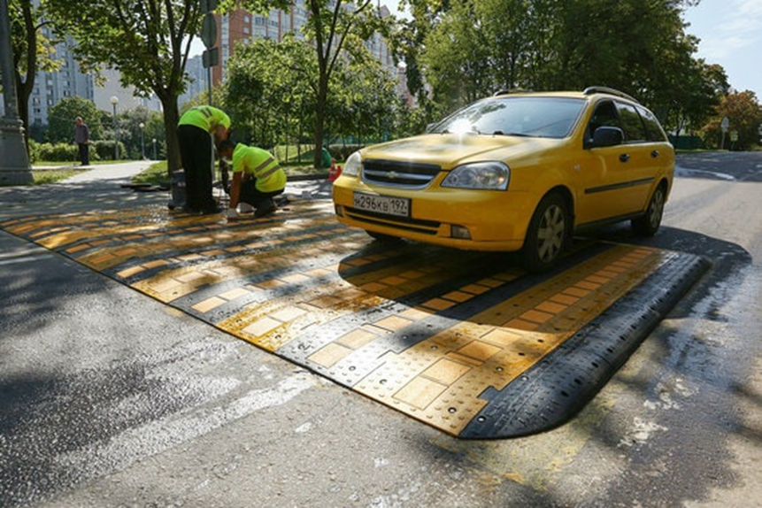
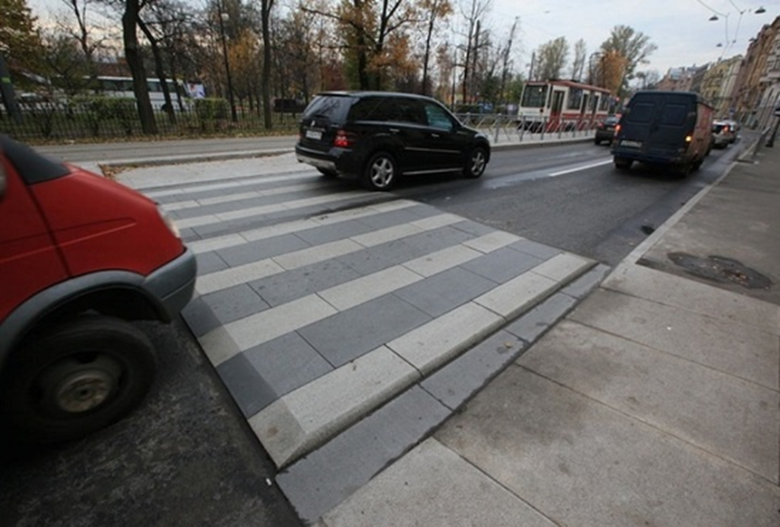
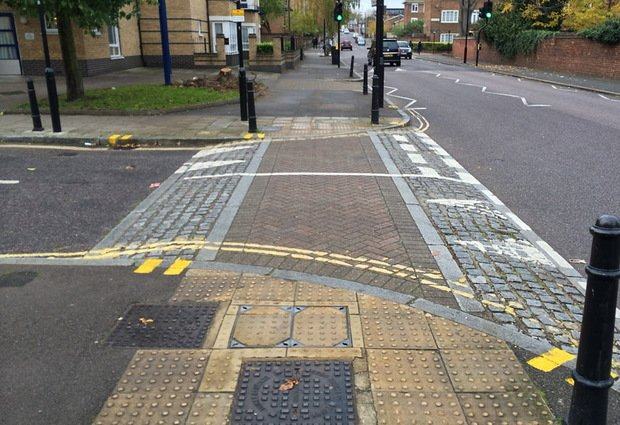
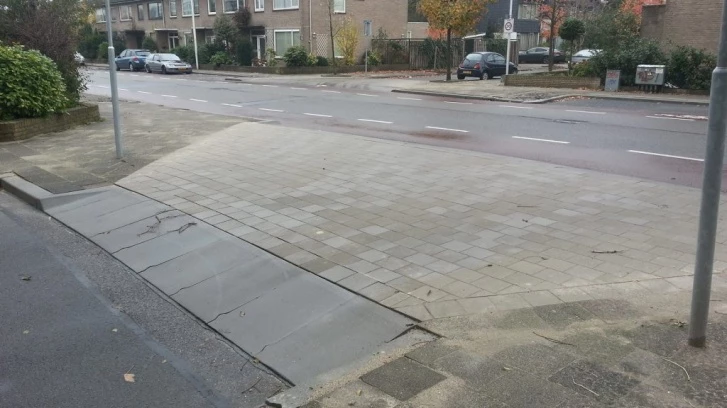

# Приподнятые пешеходные переходы

Приподнятый переход — это место, где тротуар и/или велодорожка пересекается с проезжей частью, но при этом поверхность перехода через проезжую остается на той же отметке по высоте, что и поверхность тротуара. Для автотранспорта же предусмотрены пологие пандусы для заезда и съезда с приподнятого перехода.

## Стандарты

Сейчас для таких переходов действует: 
-ГОСТ 32944-2014
Дороги автомобильные общего пользования    
ПЕШЕХОДНЫЕ ПЕРЕХОДЫ   
Классификация. Общие требования

Приподнятый пешеходный переход: Вид технических средств организации дорожного движения, представляющий собой конструкцию в виде возвышения на проезжей части дороги, устанавливаемую или устраиваемую на проезжей части дороги с целью принудительного ограничения скорости движения транспортных средств, установленной дорожными знаками или правилами дорожного движения государств - членов Евразийского экономического союза.

4.7 Устройство наземных пешеходных переходов с обозначением их дорожными знаками "Пешеходный переход" по ГОСТ 32945 и (или) горизонтальной дорожной разметкой по ГОСТ 32953 осуществляется в местах установившихся пешеходных связей и на перекрестках при интенсивности движения транспорта более 50 ед./ч и интенсивности движения пешеходов более 150 чел./ч (III зона).

6.2.11 В сложившихся неблагоприятных условиях для движения пешеходов (на участках концентрации дорожно-транспортных происшествий, вблизи детских учреждений и т.п.) необходимо осуществлять поэтапное совершенствование организации дорожного движения на обозначенных пешеходных переходах, включающее в себя:
- устройство над основной проезжей частью приподнятого пешеходного перехода;

## Зачем ?

1. Приподнятые переходы выполняют функцию искусственной неровности, перед которой водители машин вынуждены снижать скорость. Это повышает вероятность того, что они вовремя заметят пешехода или велосипедиста и пропустят его. В случае же, если водитель машины все-таки не уступит дорогу, невысокая скорость движения позволит избежать тяжелых последствий.
2. Приподнятые переходы однозначно фиксируют приоритет пешеходов и велосипедистов непосредственно в геометрии улицы: тротуар и велодорожка остаются непрерывными, а проезжая часть прерывается. Автомобили пересекают территорию пешеходов и велосипедистов, а не наоборот.
3. Приподнятые переходы позволяют пешеходам и велосипедистам «посуху» пересекать проезжую часть во время сильных дождей. В дождливую погоду вода стекает из дворов на улицы по местным проездам, где попадает в ливневую канализацию. По этой причине выезды из дворов зачастую превращаются в бурные реки, которые невозможно преодолеть, не промочив ноги. Приподнятые переходы служат своеобразными «мостами» через эти бурные потоки.

## Примеры:

### Неудачные

Переход хоть и приподнят над дорогой, но не идёт вровень с тротуаром, поэтому не будет удобен для пешеходов. 
*Источник фотографии [1]*

Переход не имеет специальных обозначений, а также выполнен из гранитный плит и слишком скользкий. 
*Источник фотографии [2]*

### Удачные

*Источник фотографии [3]*

*Источник фотографии [4]*

[1]: https://www.vedomosti.ru/politics/news/2018/08/28/779193-moskve   
[2]: https://roman-mozgovoy.livejournal.com/86162.html 
[3]: https://realnoevremya.ru/articles/114095-kak-kazani-stat-samym-bezopasnym-gorodom    
[4]: https://www.e1.ru/text/transport/2020/09/02/69450849/