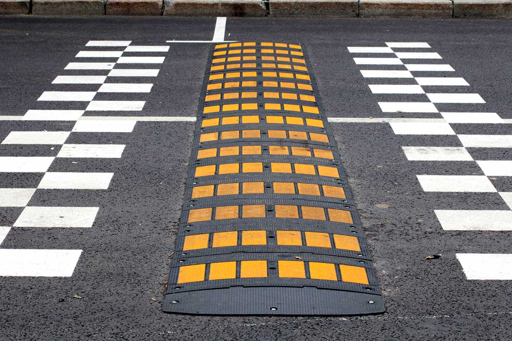
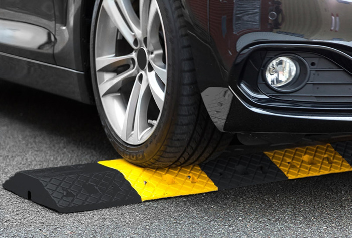
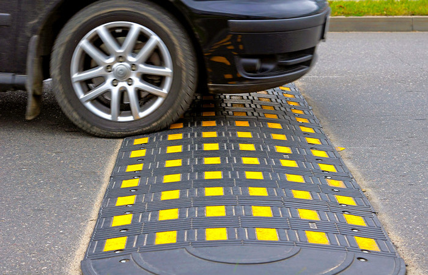

#Лежачие полицейские

Иску́сственная неро́вность (неофициальный термин «лежа́чий полице́йский»— от англ. sleeping policeman)— элемент принудительного снижения скорости транспортных средств, одна из мер успокоения дорожного движения. Термин пришёл из Англии и изначально назывался «спящий полицейский». Обычно представляют собой возвышение на проезжей части.

Впервые искусственные дорожные неровности (ИДН) или «лежачие полицейские» стали применять в США в начале XX века для принудительного ограничения скорости движения автомобилей на опасных участках дорог.

В России установка "лежачих полицейских" регулируется ГОСТ Р 52605-2006
Технические средства организации дорожного движения

## Стандарты

ГОСТ Р 52605-2006 *Источник [2]* 

##Применение

Следует отметить, что многие имеющиеся на дорогах искусственные неровности не соответствуют требованиям ГОСТ и представляют опасность для автомобилей. Наиболее распространенные нарушения - отклонение от предписанных габаритов и отсутствие знаков и разметки.
Иногда вместо настоящих лежачих полицейских применяются 3D-рисунки на плоской поверхности, создающие визуальное ощущение наличия неровности. Встречаются в некоторых городах России.

##Примеры 

 *Источник [5]* 

 *Источник [6]*

[1]: https://design-project.org/ideas/2013/cheshskoe-moshchenie-kruzheva-nogami
[2]: https://docs.cntd.ru/document/1200048469
[3]: https://ru.wikipedia.org/wiki/%D0%98%D1%81%D0%BA%D1%83%D1%81%D1%81%D1%82%D0%B2%D0%B5%D0%BD%D0%BD%D0%B0%D1%8F_%D0%BD%D0%B5%D1%80%D0%BE%D0%B2%D0%BD%D0%BE%D1%81%D1%82%D1%8C
[5]: https://www.dortec.ru/statji/tot-samyy-lezhachiy-politseyskiy.html
[6]: https://novate.ru/blogs/111219/52702/
