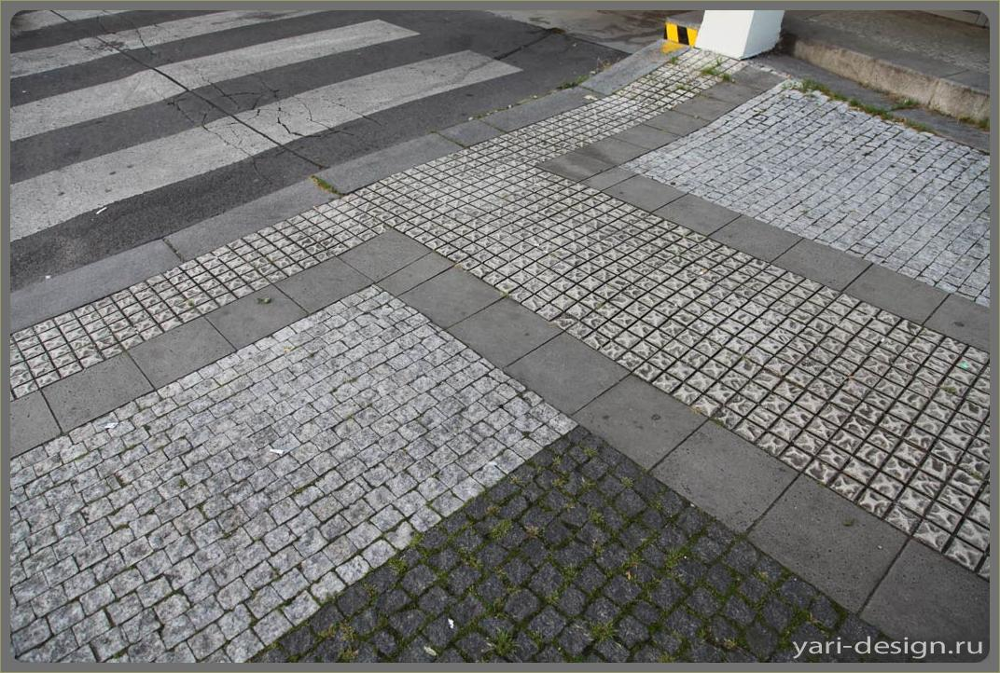
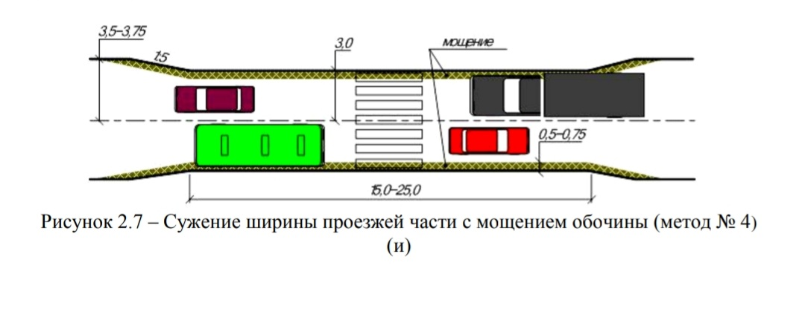
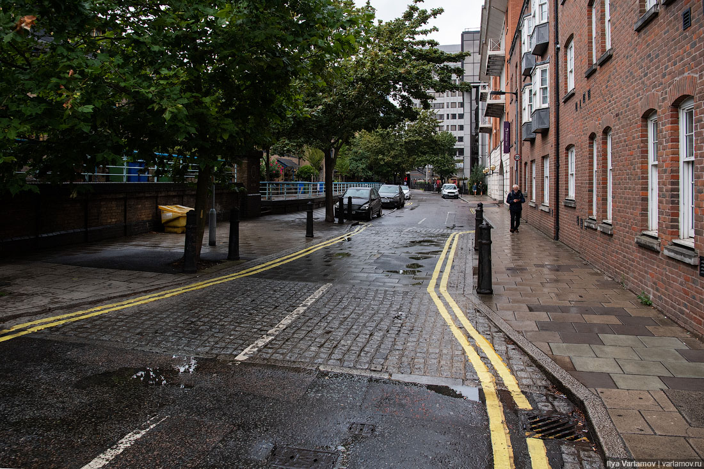
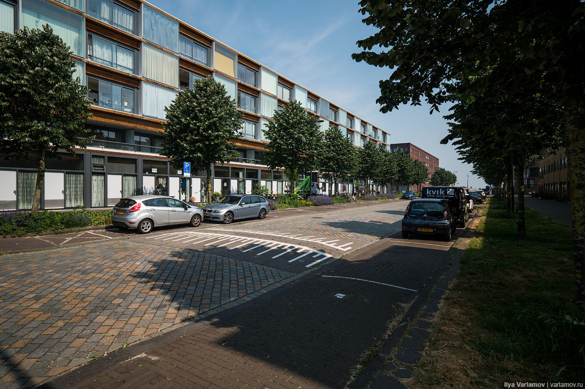
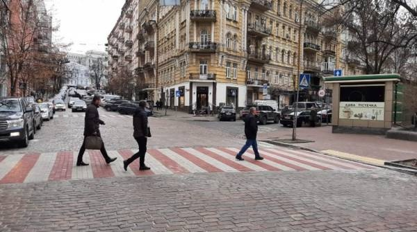
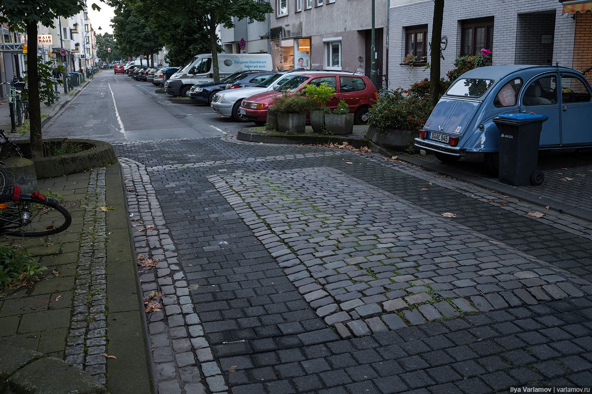

#Мощение булыжником

[1]

##Мощение 
– выкладывание дорожек, дорог, тропинок и тротуаров разнообразными материалами. Мощение – это то, на что ступит нога, по чему проедет велосипед или автомобиль и т.д., это необходимый элемент благоустройства территории. [2]

#Зачем?

Использование плитки или брусчатки позволяет снизить скорость автомобилей. Машину на таком участке будет слишком сильно трясти, поэтому быстро по такой дороге никто не едет. [3]

Для получения результата по снижению скорости, предусматривается также мощение участка проезжей части вдоль бордюрного камня шириной 0,35 - 0,75м из брусчатки, булыжного или колотого камня. 

Такого рода решения по успокоению движения могут применяться и на многополосных дорогах перед саморегулируемыми пешеходными переходами.
 *Источник [4]* 

Чтобы снизить скорость трафика можно поменять покрытие перехода на плитку или брусчатку [5]

#Примеры мощения

 *Источник [5]* 

 *Источник [6]*

 *Источник [7]*

 *Источник [8]*

[1]: https://design-project.org/ideas/2013/cheshskoe-moshchenie-kruzheva-nogami
[2]: https://www.zhilex-fito.ru/razdel-05.shtml
[3]: https://euro-pulse.ru/eurotrend/kak-sdelat-gorodskie-dorogi-bezopasnyimi-dlya-peshehoda-opyit-evropyi/
[4]: Рекомендации Минтранса
[5]: https://chelurban.ru/knowledge/calming-traffic/
[5]: https://varlamov.ru/3042559.html   
[6]: https://varlamov.ru/2951952.html
[7]: https://112ua.tv/kiev/na-ulice-vladimirskoy-v-kieve-obustroili-nazemnyy-perehod-iz-cvetnoy-bruschatki-349672.html
[8]: https://varlamov.ru/2567296.html