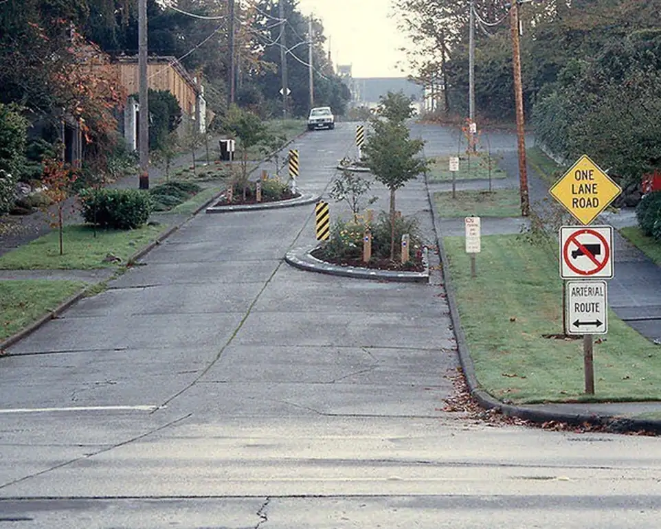
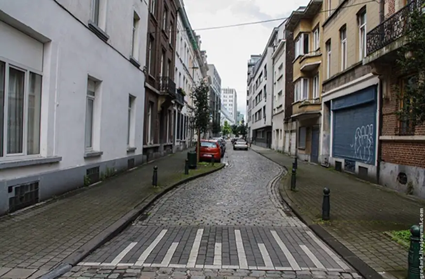
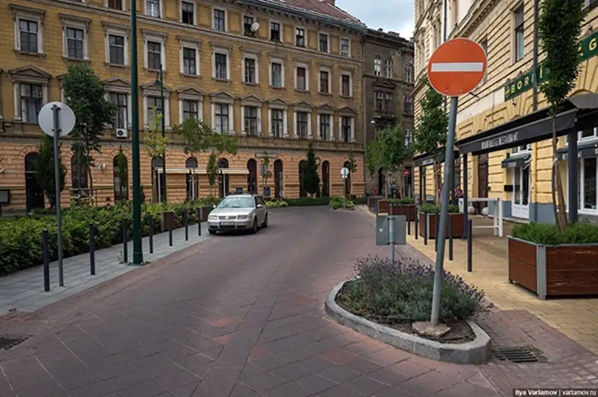
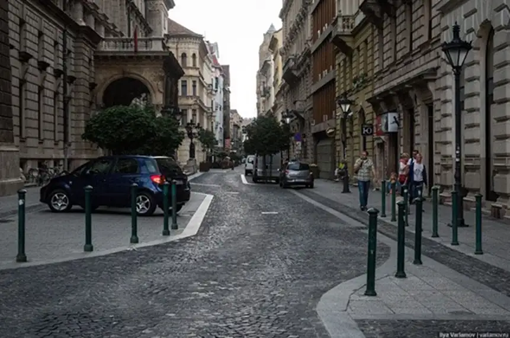
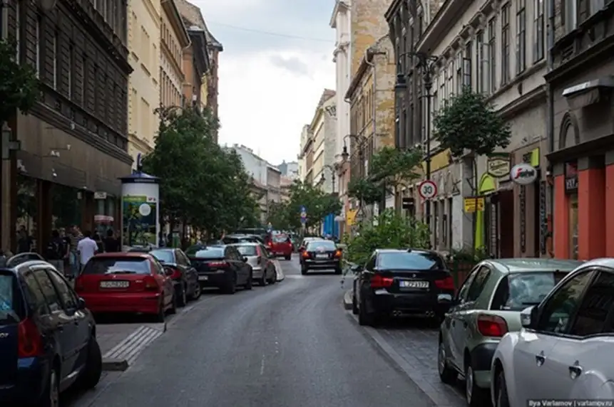

#Шиканы

 *Источник [4]*

##Шикана 
(фр. chicane; от chicaner «придраться») — последовательность тесных извивающихся поворотов (обычно в форме буквы S) на дороге, используемая в автогонках и на городских улицах для намеренного замедления автомобилей; их располагают регулярно на прямых участках для ограничения скорости.
*Источник [1]*

Ради снижения числа ДТП с пешеходами подготовлен проект нового дорожного ГОСТа, созданный РосдорНИИ по заказу Минтранса. Как сообщает «КоммерсантЪ», в ГОСТе впервые появляется термин «шикана» — связка поворотов, вынуждающая водителя сбросить скорость. Принять новый стандарт планируется в 2021 году.

«Шиканы» призваны заставлять водителей снижать скорость перед пешеходными переходами. На таких участках дорог из-за направляющих островков авто­мобили будут вынуждены двигаться зигзаго­образно. Задей­ствовать такой метод, согласно
ГОСТу, можно будет на улицах с интенсивностью движения не более 500 машин в сутки. Кроме того, планируется наносить сужающую разметку по краям проезжей части.
*Источник [2]*

##Зачем?

Их можно обустроить с помощью разметки, парковки, клумб или других малых архитектурных форм.
Кроме того, они уменьшают радиус поворота автомобилей, тем самым снижая их скорость и делая перекрёстки более безопасными.
*Источник [3]*

Шиканы можно устраивать на узких улочках и междворовых проездах. Там часто возникают опасные ситуации, 
когда люди могут резко появиться на дороге.

##Примеры

 *Источник [4]*
 *Источник [4]*
 *Источник [4]*
 *Источник [4]*

Смещения выступов тротуара относительно друг друга создают эффект шиканы (S-образного поворота). Они расширяют общественное пространство и на них, например, можно разместить скамейки и велопарковки.

Разместите дополнительную разметку и дорожные знаки. Для устройства
выступов можно применять недорогие временные материалы — съемные бордюры, столбики, контейнеры для растений или разметку.

Шикану можно получить, разместив парковочные места в шахматном порядке по обеим сторонам улицы.

 

[1]: https://ru.m.wikipedia.org/wiki/%D0%A8%D0%B8%D0%BA%D0%B0%D0%BD%D0%B0_(%D0%B0%D0%B2%D1%82%D0%BE%D1%81%D0%BF%D0%BE%D1%80%D1%82)
[2]: https://mag.auto.ru/article/roadgostshikana/
[3]: https://chelurban.ru/knowledge/calming-traffic/
[4]: https://chelurban.ru/knowledge/shikany/
